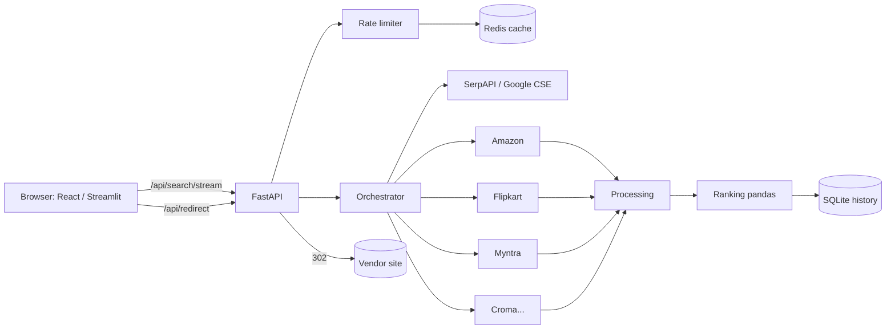
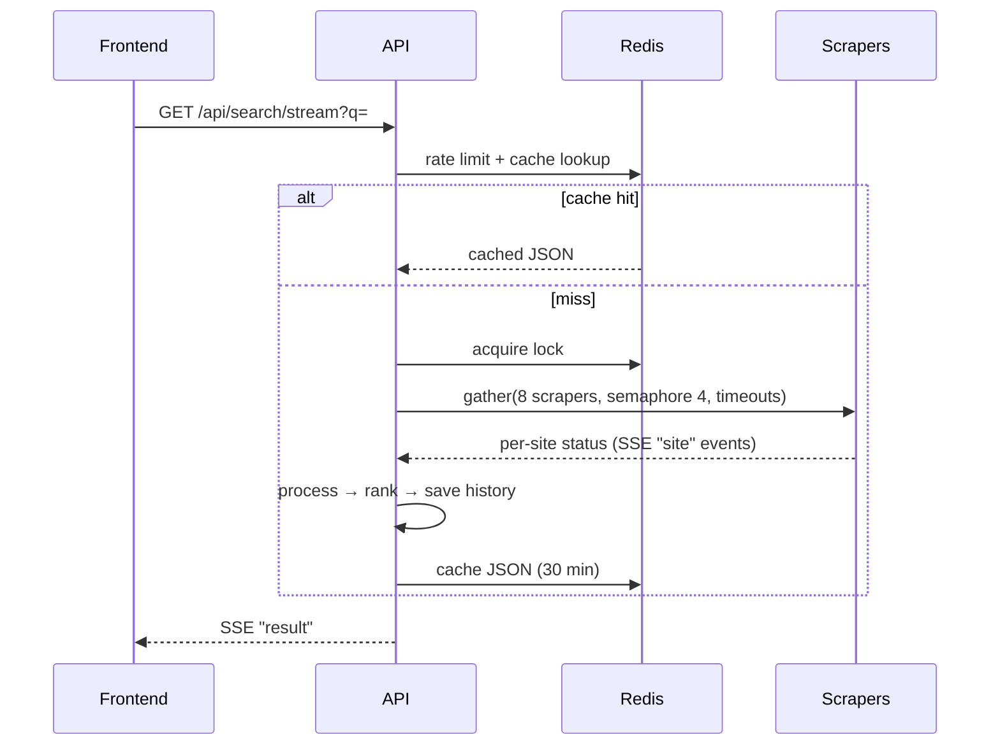

# 🕸️ PriceVerse: E-Commerce Price Comparison & Product Recommendation System

Academic project (Data Engineering Honours, *Web Scraping & APIs*). You search for a product. PriceVerse finds it on Google and on 8 Indian stores, scrapes and cleans the listings, ranks them, and links you to the best deal.

## Link : https://priceverse-ui.vercel.app/

## Features
* Discovery through SerpAPI and Google CSE, then parallel scraping of 8 stores with Playwright and httpx.
* Extraction tries four layers in order: JSON-LD, page state JSON, captured XHR responses, then CSS selectors.
* Prices, offers, delivery dates and ratings are normalized. The pipeline filters irrelevant items, drops duplicates and validates everything with Pydantic.
* Results are scored with a weighted formula. The summary picks the cheapest, best-deal, fastest-delivery and top-rated items.
* Redis handles the cache (with a stampede lock) and the rate limits. If Redis is down, an in-memory fallback takes over.
* Price history is stored in SQLite. Every redirect click is logged, and only allow-listed store URLs can be redirected to.
* The frontend uses Server-Sent Events, so you see each store finish live.
* Demo mode makes sure the project always works during a presentation.
* The comic-style React UI and a Streamlit edition are both included.

## Architecture




## Tech stack
| Layer | Tech |
|---|---|
| API | Python 3.11, FastAPI, Pydantic v2 |
| Scraping | Playwright, httpx, selectolax, tenacity |
| Search | SerpAPI, Google Custom Search |
| Cache / limits | Redis (with in-memory fallback) |
| Storage | SQLAlchemy 2.0 + SQLite (Postgres-ready) |
| Ranking | pandas |
| UI | React 18, Vite, TS, Tailwind, Framer Motion, Recharts, TanStack Query, Zustand |
| Deploy | Docker, Render/Fly, Vercel, Streamlit Cloud, HF Spaces |

## Environment variables
| Var | Meaning | Default |
|---|---|---|
| REDIS_URL | Redis connection | redis://localhost:6379/0 |
| SERPAPI_KEY / GOOGLE_CSE_KEY / GOOGLE_CSE_CX | Google discovery (optional) | empty |
| PROXY_URL | comma-separated proxies (optional) | empty |
| SCRAPER_API_KEY | ScraperAPI, used only when a site blocks us | empty |
| ENABLED_SCRAPERS | which adapters run | all 8 |
| CACHE_TTL_SECONDS | cache freshness | 1800 |
| RATE_LIMIT_PER_MIN | searches per IP per minute | 10 |
| DEMO_MODE | serve mock data | false |
| ALLOWED_ORIGINS | CORS origins | localhost |
| DATABASE_URL | SQLAlchemy URL | sqlite |
| VITE_API_BASE_URL | backend URL for the frontend | http://localhost:8000 |

## API
```bash
curl "http://localhost:8000/api/search?q=iphone%2015"
curl -N "http://localhost:8000/api/search/stream?q=iphone%2015"
curl  http://localhost:8000/api/health
curl  http://localhost:8000/api/sites
curl "http://localhost:8000/api/history?q=iphone%2015&days=30"
curl -I "http://localhost:8000/api/redirect?url=https%3A%2F%2Fwww.amazon.in%2Fdp%2FB0CHX1W1XY&site=amazon.in"
```
The full response shape is in the master prompt §4: `query, cached, demo, generated_at, took_ms, sites[], results[], summary`. Interactive docs are at `/docs`.

## Adding a new store
1. Create `backend/app/scrapers/mystore.py`:
```python
from urllib.parse import quote_plus
from app.scrapers.base import BaseScraper
SELECTORS = {"card": ["div.product"], "title": ["h2"], "price": ["span.price"], "link": ["a@href"], "image": ["img@src"]}
class MyStore(BaseScraper):
    name, domain, base_url, needs_browser = "mystore", "mystore.in", "https://www.mystore.in", False
    SELECTORS = SELECTORS
    def search_url(self, query: str) -> str:
        return f"https://www.mystore.in/search?q={quote_plus(query)}"
```
2. Register it in `registry.py`: `"mystore": MyStore,`
3. Add the domain to `SITE_DOMAINS`, `TRUST` and `SITE_LABELS` in `config.py`, and to `STORES` in `frontend/src/lib/format.ts`.
4. Add it to `ENABLED_SCRAPERS`. Save a fixture with `python -m scripts.record_fixtures "query" mystore` and write a test for it.

## Tests
`cd backend && pytest -q`. The tests run fully offline: they use saved HTML fixtures, demo mode and the in-memory cache.

## Deployment
* **Backend on Render.** Choose New → Blueprint, which picks up `render.yaml`. You can also create a Docker web service with root `backend`. Use at least 1 GB RAM for Chromium, set the health check to `/api/health`, and use Upstash Redis for `REDIS_URL`. Free instances sleep when idle, so the first request after a pause takes about 30–60 s.
* **Backend on Fly.io.** Run `cd backend && fly launch --copy-config && fly deploy`.
* **Frontend on Vercel.** Set the root directory to `frontend`, the build command to `npm run build` and the output to `dist`. Set `VITE_API_BASE_URL=https://<backend>`, then set the backend's `ALLOWED_ORIGINS=https://<app>.vercel.app`.
* **Streamlit Cloud.** Point it at `streamlit/streamlit_app.py`. Without a secret it runs on demo data. Add the secret `API_BASE_URL` to use the live backend.
* **HF Spaces.** Create a Docker Space, push the contents of `backend/` and add `EXPOSE 7860`. Set `PORT=7860` and `DEMO_MODE=true` (or false if you have proxies).
* **Production checklist:**
  * Keep secrets in env vars and serve everything over HTTPS.
  * Lock CORS to your own origins and keep rate limits on.
  * Watch the JSON logs, and use `/api/sites` for monitoring.
  * When a store changes its layout, update its `SELECTORS` dict and re-record its fixture.

## Troubleshooting
* **A store shows "blocked" or a CAPTCHA.** This is expected when running from datacenter IPs. Options: add `SERPAPI_KEY`, `PROXY_URL` or `SCRAPER_API_KEY`, or use `DEMO_MODE=true`.
* **Playwright errors.** Run `playwright install chromium`. On Linux, also run `playwright install-deps`.
* **Redis connection refused.** The app keeps working with the in-memory fallback. Start Redis with `docker run -p 6379:6379 redis:7`.
* **CORS errors.** Add the frontend URL to `ALLOWED_ORIGINS` and restart the API.

## Legal & ethics
This project is for academic demonstration only. Read each site's Terms of Service and robots.txt before scraping. The scrapers make small, rate-limited requests and never solve CAPTCHAs. For production, use the official affiliate or product APIs (for example Amazon PA-API or Flipkart Affiliate).

## Limitations & future work
Limitations: selectors break when sites change, datacenter IPs get blocked, and product matching is fuzzy. Future work: price alerts, official affiliate feeds, ML-based product matching and a browser extension.
